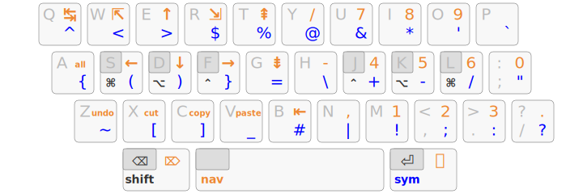
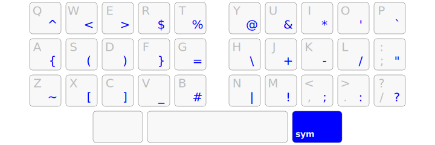
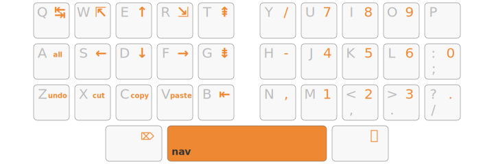
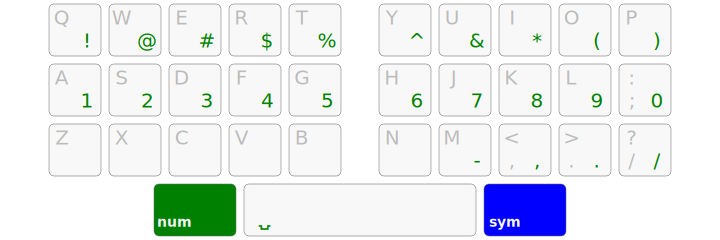
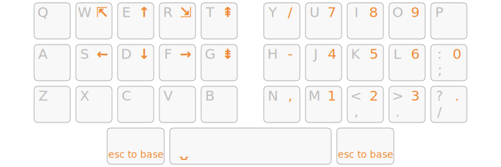
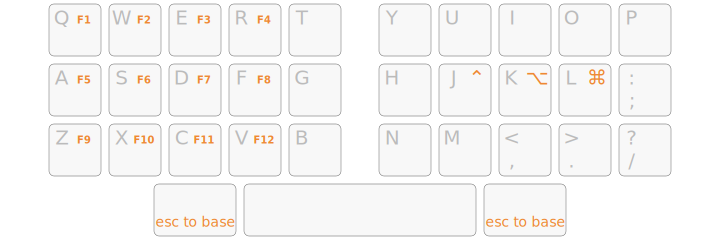
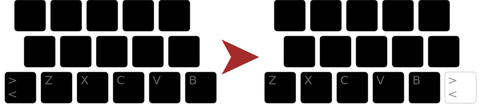

# Kanata Layout — Arsenik-Inspired 34-Key Split

A [Kanata](https://github.com/jtroo/kanata) implementation of a 34-key columnar-stagger layout, heavily inspired by [OneDeadKey's Arsenik](https://github.com/OneDeadKey/arsenik/) QMK layout. Adapted for full-size keyboards with `process-unmapped-keys yes` to capture and block all keys outside the 34-key core.

## The Arsenik Layout

The original Arsenik layout by [OneDeadKey](https://github.com/OneDeadKey/arsenik/) is a French-optimized ortholinear layout built for QMK/ZMK firmware. This Kanata config ports its design philosophy to a software remapper running on a standard staggered keyboard.

The layout images below are from the Arsenik project and show the design this config is based on:



## Physical Keyboard — 34-Key Core

The config captures every key on a full-size keyboard but only uses the 34 inner keys:

```
Row 1:  1    2    3    4    5         6    7    8    9    0
Row 2:  Q    W    E    R    T         Y    U    I    O    P
Row 3:  A    S    D    F    G         H    J    K    L    ;
Row 4:  Z    X    C    V    B    <    N    M    ,    .    /
                  LAlt      Space      RAlt
```

All physical keys outside this 34-key block (modifiers, arrows, F-keys, numpad, number row, etc.) are declared in `defsrc` and mapped to `XX` (no-op) in every layer. This forces you to use layer taps for everything — no escape hatch to physical keys.

## Layers

### Base — Home-Row Mods


Home-row modifier keys on a hold-tap with `tap-hold-release-keys` and same-hand suppression:

| Key | Tap | Hold          |
| --- | --- | ------------- |
| A   | a   | Shift (left)  |
| S   | s   | Alt (left)    |
| D   | d   | Super (left)  |
| F   | f   | Ctrl (left)   |
| J   | j   | Ctrl (right)  |
| K   | k   | Super (right) |
| L   | l   | Alt (right)   |
| ;   | ESC | Shift (right) |

Caps Lock is disabled (XX). Physical Delete is disabled (XX).

Anti-misfire: same-hand key detection via `$left-hand-keys` / `$right-hand-keys` variable lists prevents accidental modifier activation when rolling.

### Thumb Keys


| Thumb               | Tap   | Hold                          |
| ------------------- | ----- | ----------------------------- |
| Left thumb (Space)  | Space | Navigation layer (hold 250ms) |
| Right thumb (Enter) | Enter | Symbols layer                 |

### Symbols



Programming symbols accessed by holding the right thumb (Enter). Mirrors the Arsenik symbol placement:

```
Q→^   W→<   E→>   R→$   T→%       Y→@   U→&   I→*   O→'   P→`
A→{   S→(   D→)   F→}   G→=       H→\   J→+   K→-   L→/   ;→"
Z→~   X→[   C→]   V→_   B→#       N→|   M→!   ,→;   .→:   /→?
                                        ;→ESC (tap) / Shift (hold)
```

### Navigation



Vim-style arrows on HJKL, plus editor shortcuts. Activated by holding the left thumb (Space):

```
Q→Tab       W→Home     E→Up       R→End      T→PgUp
A→Ctrl+A    S→Left     D→Down     F→Right    G→PgDn
Z→Ctrl+Z    X→Ctrl+X   C→Ctrl+C   V→Ctrl+V   B→Bksp
                                        H→-    J→4   K→5   L→6   ;→0
```

### NumRow



Numbers and shifted symbols on the home row. Activated by holding the left thumb while in Navigation layer (layer stacking):

```
Q→!   W→@   E→#   R→$   T→%       Y→^   U→&   I→*   O→(   P→)
A→1   S→2   D→3   F→4   G→5       H→6   J→7   K→8   L→9   ;→0
```

### Numpad



Calculator-style numpad with arrow keys on the left hand:

```
Q          W→Home   E→Up     R→End    T→PgUp
                           H→/     J→7     K→8     L→9
                     S→Left  D→Down  F→Right G→PgDn  H→-   J→4   K→5   L→6   ;→0
                                            H→,    J→1   K→2   L→3   ;→.
```

### Workspace


Workspace switching via dual-thumb chord (lalt + ralt held together). Home row sends Super+1 through Super+0:

```
Q          W        E        R        T
A→Super+1  S→Super+2  D→Super+3  F→Super+4  G→Super+5
Z          X        C        V        B
                                        H→Super+6  J→Super+7  K→Super+8  L→Super+9  ;→Super+0
```

**Usage:** Hold both thumb keys (lalt + ralt) together, tap a home-row letter to switch workspace, release thumbs to return to base.

### Function Keys



F1–F12 on the left hand, modifiers on the right:

```
Q→F1   W→F2   E→F3   R→F4
A→F5   S→F6   D→F7   F→F8
Z→F9   X→F10  C→F11  V→F12
                              J→Ctrl   K→Alt   L→Super
```

## Angle Mod

The layout uses an angle mod for the bottom-left keys, shifting ZXCVB inward for better ergonomics on staggered keyboards:



## Configuration

### Variables

```lisp
(defvar
  tap-time 150          ;; ms to register a tap
  hold-time 200         ;; ms to register a hold
  left-hand-keys (1 2 3 4 5 q w e r t a s d f g z x c v b <)
  right-hand-keys (6 7 8 9 0 y u i o p h j k l ; n m , . / bspc)
)
```

### Chords

Dual-thumb chord for workspace switching:

```lisp
(defchordsv2
  (lalt ralt) (layer-while-held workspace) 350 all-released ()
)
```

### going cold turkey

All keys outside the 34-key core are mapped to `XX` (no-op) in every layer. The physical number row, modifiers, arrows, F-keys, and numpad are all silenced. Numbers are only accessible via the `num` thumb chord (Navigation → NumRow layer stacking).

**Exceptions:**
- Print Screen is mapped to `lrld` (live reload) for convenient config reloading
- Both thumbs together (lalt + ralt) activates the workspace layer for Super+1..0 workspace switching

### Key Remaps

| Physical Key    | Action                        |
| --------------- | ----------------------------- |
| Semicolon (`;`) | Tap: ESC, Hold: Shift (right) |
| Print Screen    | Live reload config (`lrld`)   |
| Both thumbs     | Workspace layer (Super+1..0)  |

## File Structure

```
kanata/
├── config.kbd              # Main config: defcfg, defvar, includes
├── defsrc/
│   └── pc.kbd              # Source key capture (all physical keys)
├── defalias/
│   └── qwerty.kbd          # Alias definitions (symbols, nav shortcuts)
├── deflayer/
│   ├── base.kbd            # Base layer + home-row mods + thumb holds
│   ├── symbols.kbd         # Symbols + numrow layers
│   └── navigation.kbd      # Navigation + numpad + funpad layers
└── docs/
    └── images/             # Arsenik layout reference images
        ├── all.svg
        ├── symbols.svg
        ├── navigation.svg
        ├── numpad.svg
        ├── fn.svg
        ├── numrow.svg
        ├── hrm.svg
        ├── layer_taps.svg
        └── angle_mod.svg
```

## Credits

- **[Arsenik Layout](https://github.com/OneDeadKey/arsenik/)** by [OneDeadKey](https://github.com/OneDeadKey/) — the primary inspiration for this layout's symbol placement, home-row mods, and layer structure
- **[Kanata](https://github.com/jtroo/kanata)** — the keyboard remapping software
- **[urob's timeless homerow mods](https://github.com/urob/zmk-config)** — inspiration for the same-hand suppression approach
