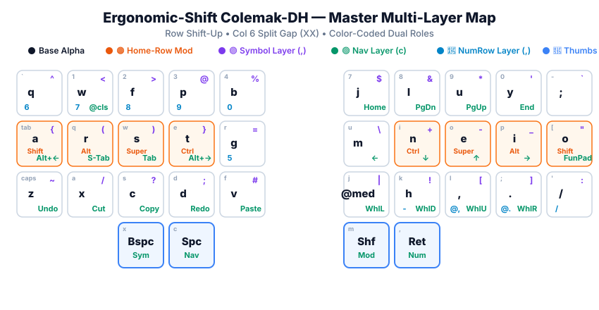
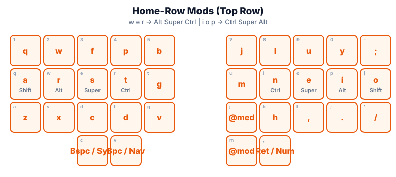
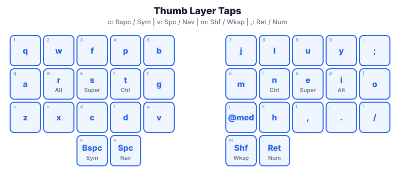
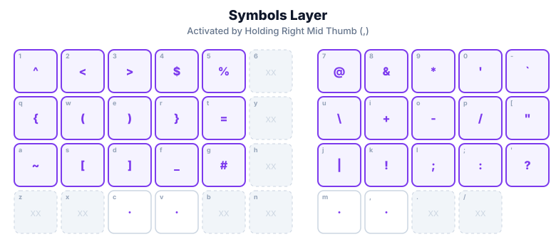
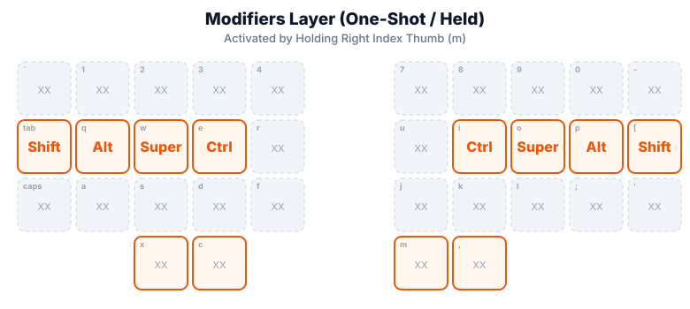
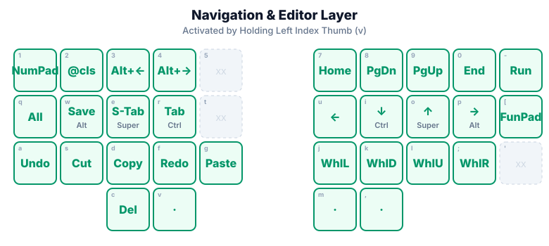
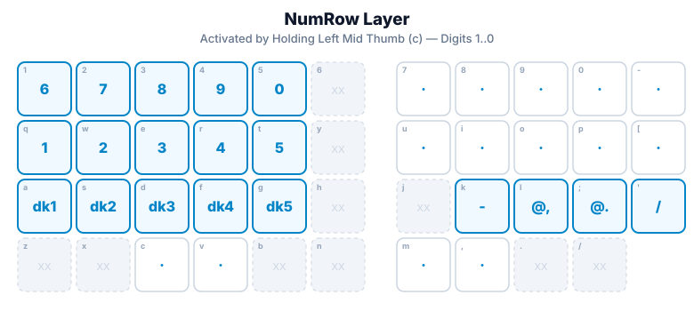
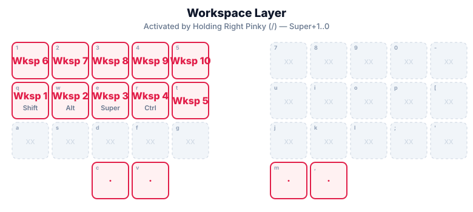

# Kanata Layout — Ergonomic-Shift Colemak-DH

A [Kanata](https://github.com/jtroo/kanata) implementation of the **Ergonomic-Shift** Colemak-DH layout for standard staggered full-size or laptop keyboards.

## Overview & Design Philosophy

Ergonomic-Shift transforms a standard staggered keyboard into an ergonomic columnar-like layout by applying two primary shifts:

1. **Shift-Up**: The entire alpha block is shifted up by one physical row.
   - The home row moves to the physical QWERTY top row (`qwert` / `iop[`).
   - The physical bottom row (`c`, `v`, `m`, `,`) becomes four dedicated thumb keys.
2. **Split Hands (Dead Column 6)**: The right hand is shifted right by one physical column.
   - The entire physical column `6`, `y`, `h`, `n` (along with `bspc`) is dead (`XX`).
   - This creates a clean, vertical gap between the hands while keeping the Colemak-DH finger-to-letter column assignments straight.

### Layout Overview



### Key Features

- **Colemak-DH Base**: Ergonomic layout optimized for English typing.
- **Un-Angled Bottom Alpha Row**: Standard Colemak-DH columns (`z x c d v` mapped to physical `a s d f g`). Because physical Row 3 staggers 0.25U to the right of Row 2, standard fingering naturally matches left arm ergonomics without requiring an angle mod.
- **Home-Row Mods**: Shifted to top physical row (`w e r` left, `i o p` right) in the order: **Alt, Super, Ctrl** (Ring to Index). Pinkies (`q` and `[`) are plain `a` and `o` with zero tap-hold delay.
- **Escape Combo**: Physical keys `3` + `4` (`f` + `p`) pressed together emit **Escape** with 100% zero-collision reliability.
- **4 Thumb Keys**:
  - `c` (Left Middle): Tap = Backspace, Hold = **Symbols** layer
  - `v` (Left Index): Tap = Space, Hold = **Navigation** layer
  - `m` (Right Index - Rest): Tap = Sticky Shift (`one-shot 2000 lsft`), Hold = **Workspace** layer (Super+1..0)
  - `,` (Right Middle - Angled): Tap = Enter, Hold = **NumRow** layer
- **Full Capture (`process-unmapped-keys yes`)**: Outer physical keys (arrows, F-keys, numpad, original spacebar row) are silenced (`XX`).
- **Same-Hand Suppression**: Home-row mods use `$left-hand-keys` and `$right-hand-keys` lists plus `tap-hold-require-prior-idle 150` to prevent misfires during fast typing.

---

## Physical Keyboard Mapping

### Left Hand (Columns 1–5)

```
Physical Row            Mapping (Output)
─────────────────────────────────────────────────────────────
1  2  3  4  5          q  w  f  p  b          (Number row)
q  w  e  r  t          a @r @s @t  g          (Top row — HOME: a, Alt, Super, Ctrl, g)
a  s  d  f  g          z  x  c  d  v          (Home row — Bottom alpha row)
z  x  c  v  b  <      XX XX @bspsym @nav XX XX    (Bottom row — Thumbs on c and v)
```

### Right Hand (Columns 7–11, Column 6 Dead)

```
Physical Row            Mapping (Output)
─────────────────────────────────────────────────────────────
6 (XX)  7  8  9  0  -     XX  j  l  u  y  ;   (Number row)
y (XX)  u  i  o  p  [     XX  m @n @e @i  o   (Top row — HOME: XX, m, Ctrl, Super, Alt, o)
h (XX)  j  k  l  ;  '     XX  k  h  ,  .  /   (Home row)
n (XX)  m  ,  .  /        XX @shfwsp @entnum XX XX (Bottom row — Thumbs on m and ,)
```

- **Gap Column**: Physical `6`, `y`, `h`, `n` are `XX` in all layers.
- **Spacebar Row**: `lalt`, `spc`, `ralt` are all `XX`.

---

## Layers

### Base — Colemak-DH & Home-Row Mods



Home-row modifiers live on physical top row (`q w e r` and `i o p [`):

| Hand  | Key | Tap | Hold Mod      |
| ----- | --- | --- | ------------- |
| Left  | `q` | `a` | Shift (left)  |
| Left  | `w` | `r` | Alt (left)    |
| Left  | `e` | `s` | Super (left)  |
| Left  | `r` | `t` | Ctrl (left)   |
| Right | `i` | `n` | Ctrl (right)  |
| Right | `o` | `e` | Super (right) |
| Right | `p` | `i` | Alt (right)   |
| Right | `[` | `o` | Shift (right) |

### Thumb Keys



| Thumb Key   | Physical Key | Tap                  | Hold Layer                 |
| ----------- | ------------ | -------------------- | -------------------------- |
| Left Mid    | `c`          | Backspace            | **Symbols**                |
| Left Idx    | `v`          | Space                | **Navigation**             |
| Right Idx   | `m` (Rest)   | *(None)*             | **Modifiers (Callum-style)** |
| Right Mid   | `,` (Angled) | Enter                | **NumRow**                 |

### Symbols Layer



Activated by holding `c` (Left Mid thumb). Provides Lafayette / Ergo-L inspired programming symbols:

```
Number row:  _  <  >  $  %  | (col 6 dead) |  @  &  *  '
Top row:     {  (  )  }  =  | (col 6 dead) |  \  +  -  /  "
Home row:    ~  ;  :  ^  #  | (col 6 dead) |  |  !  [  ]
Bottom row:  ?  `           | (col 6 dead) |  "
```

### Modifiers Layer (Callum-style)



Activated by holding `m` (Right Idx thumb). Provides instant, sequential, one-shot modifiers on both hands to eliminate timing delays or roll issues for shortcuts:

* **Left Hand Home-Row Mods:** `Shift` (Pinky), `Alt` (Ring), `Super` (Middle), `Ctrl` (Index)
* **Right Hand Home-Row Mods:** `Ctrl` (Index), `Super` (Middle), `Alt` (Ring), `Shift` (Pinky)

To type a shortcut like `Ctrl+s`, hold `m`, tap `s` (Middle finger), release `m`, tap `s` on base. Or tap multiple modifiers sequentially while holding `m`.

### Navigation & NumPad Layer



Activated by holding `v` (Left Idx thumb). Vim-style navigation on the right hand, editor shortcuts on the left hand:

```
Top row:     NumPad(switch)  Close(Ctrl+W)  Back(Alt+←)  Fwd(Alt+→)  |  Home  PgDn  PgUp  End
Home row:    SelectAll(Ctrl+A) Save(Ctrl+S) S-Tab        Tab         |  Left  Down  Up    Right
Bottom row:  Undo(Ctrl+Z)    Cut(Ctrl+X)    Copy(Ctrl+C) Redo(Ctrl+Y) Paste(Ctrl+V) | WheelL WheelD WheelU WheelR
```

- **NumPad**: Switch to full numpad layout via `@pad` (physical `1`/`q`).
- **FunPad**: Hold physical `'` (`@fun`) to access F1–F12 keys.

### NumRow Layer



Activated by holding `,` (Right Mid thumb). Numbers 1..0 on the left hand:

```
Top row:     6  7  8  9  0
Home row:    1  2  3  4  5
```

Right-hand keys pass through as plain letters (`_`) so vim relative movement commands (e.g. `2j` / `2k`) roll naturally without layer interference.

### Workspace Layer



Activated by holding `/` (Right Pinky, physical quote key `'`). Sends Super+1 through Super+0 on the left hand for window manager workspace switching:

```
Top row:     Super+6  Super+7  Super+8  Super+9  Super+0
Home row:    Super+1  Super+2  Super+3  Super+4  Super+5
```

---

## Configuration

### Variables & Suppression

```lisp
(defvar
  tap-time 150          ;; ms to register a tap
  hold-time 200         ;; ms to register a hold
  left-hand-keys (1 2 3 4 5 q w e r t a s d f g z x c v b <)
  right-hand-keys (6 7 8 9 0 - y u i o p [ ] ' h j k l ; n m , . / bspc)
)
```

### Kanata Settings

- `tap-hold-require-prior-idle 150`: requires 150ms of idle time before a hold activates, preventing accidental mod triggers during fast typing rolls.
- **Live Reload**: `prtsc` is mapped to `lrld` to reload config without restarting Kanata.

---

## File Structure

```
.config/kanata/
├── config.kbd              # Main config: defcfg, defvar, includes
├── defsrc/
│   └── pc.kbd              # Source key capture (103 physical keys)
├── defalias/
│   └── qwerty.kbd          # Shared symbol and shortcut aliases
└── deflayer/
    ├── colemak-dh-base.kbd # Base Colemak-DH layer + home-row mods + thumbs
    ├── symbols.kbd         # Symbols + NumRow layers
    └── navigation.kbd      # Navigation + NumPad + FunPad + Workspace layers
```

---

## Credits

- **[Kanata](https://github.com/jtroo/kanata)** — keyboard remapping engine.
- **[Colemak-DH](https://colemakmods.github.io/comfy-ergonomic-keyboard/colemak_dh.html)** — ergonomic alpha layout.
- **[Ergo-L / Lafayette](https://ergo-l.fr/)** — symbol layer inspiration.
